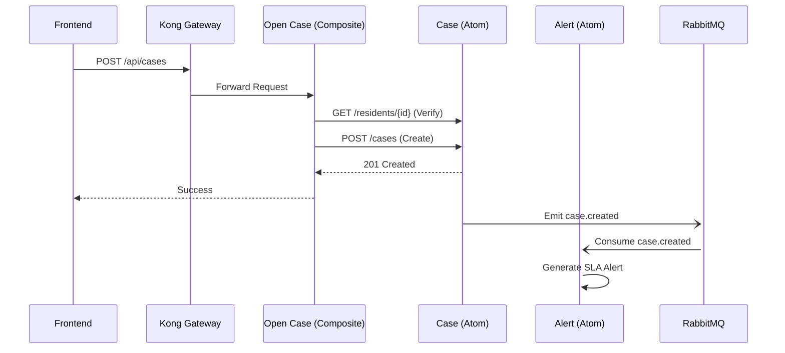

# System Architecture

## Core Philosophy: Atomic & Composite

TownOps is built around the **Atomic/Composite** microservices pattern, which is designed to prevent the "distributed monolith" problem.

### 1. Atomic Services (Atoms)

- **Role**: Domain Data Owners.
- **Tech**: Python 3.11+, FastAPI, Supabase-py/Drizzle.
- **Rules**:
  - Each atom owns exactly one database schema (or a set of related tables).
  - Atoms **never** call other atoms via HTTP.
  - Atoms are agnostic of the business processes they belong to.
  - Data changes are broadcasted via **Domain Events** on RabbitMQ.

### 2. Composite Services (Composites)

- **Role**: Business Logic Orchestrators.
- **Tech**: Node.js/Bun, Hono, TypeScript.
- **Rules**:
  - Composites do not have their own persistent storage.
  - They coordinate multiple atoms using HTTP REST calls.
  - They are responsible for transaction management (Saga pattern where applicable).
  - They expose process-oriented APIs (e.g., `POST /open-case`).

### 3. Messaging Layer (AMQP)

- **Broker**: RabbitMQ.
- **Patterns**:
  - **Pub/Sub**: Atoms publish events (e.g., `case.created`).
  - **Worker Queues**: Background tasks (e.g., sending an email after an alert is generated).
  - **Dead Letter Exchanges (DLX)**: Handling retries and failed processing.

## Data Flow Illustration

## Scaling Strategy

- **Horizontal Scaling**: Each service is containerized (Docker/ACA) and can be scaled independently based on load.
- **Scale-to-Zero**: Infrastructure supports scale-to-zero for development and idle production environments to minimize costs.
